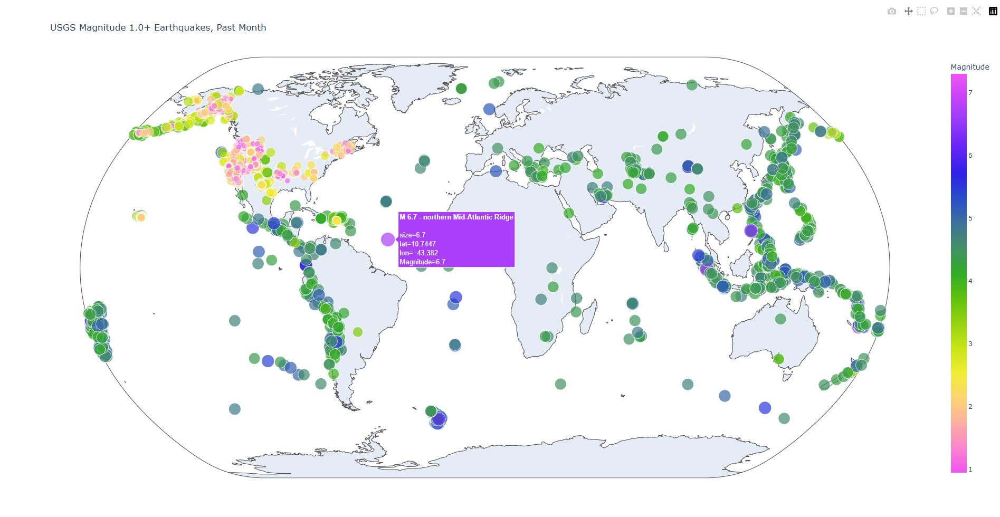

# World Earthquake-2021 data visual representation using plotly and python

In this project, I have implement two dices combination of result. This project mainly learn about plotly
and applying knowledge through the project.

## Tools and technic used for this project:

- Python
- Plotly: scatter_geo()
- Read data from geojson

## Here is the output of this project:

