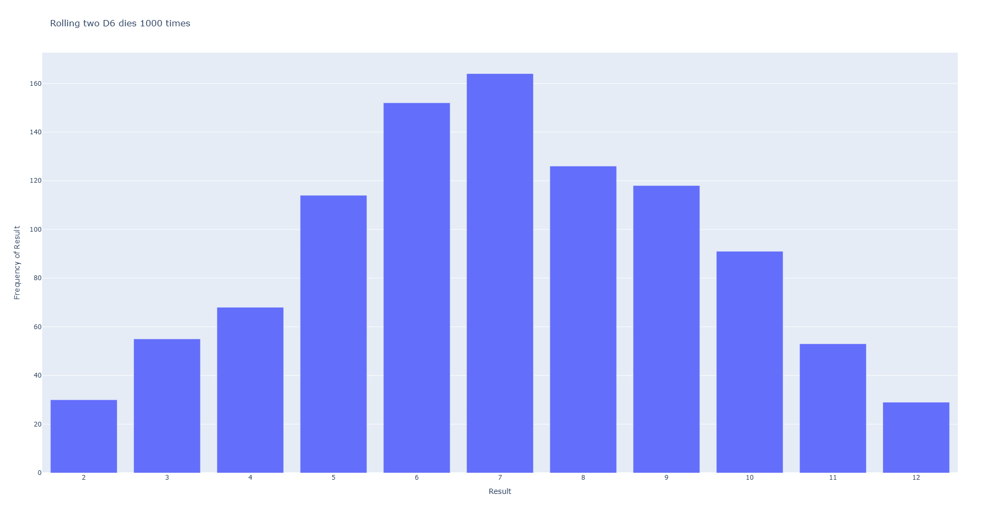
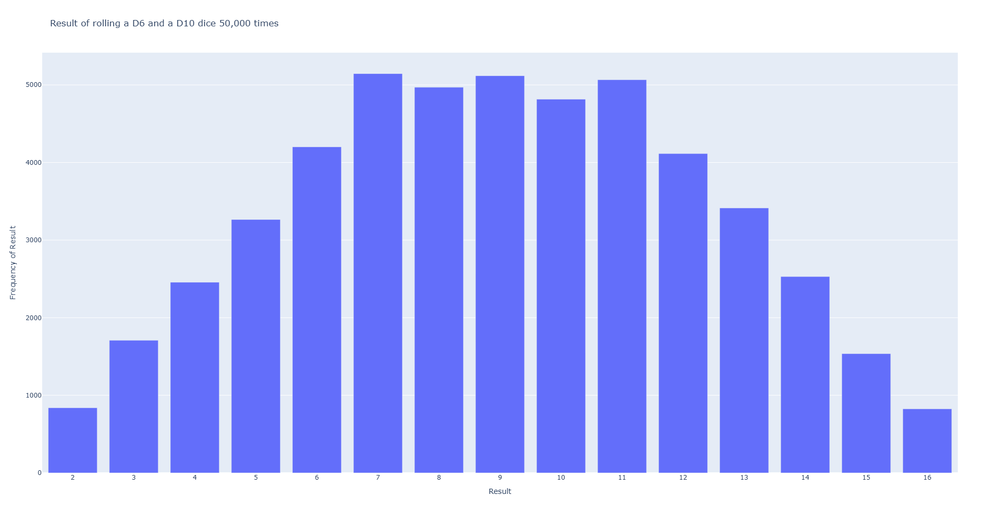

# Rolling Dice visual representation using plotly and python

In this project, I have implement two dices combination of result. This project mainly learn about plotly
and applying knowledge through the project.

## Tools and technic used for this project:

- Python
- Plotly: Bar Charts

## Here is the output of this project:

### Two D6 dice result combination - 1000 times

### A D6 and a D10 dice - 50,000 times

